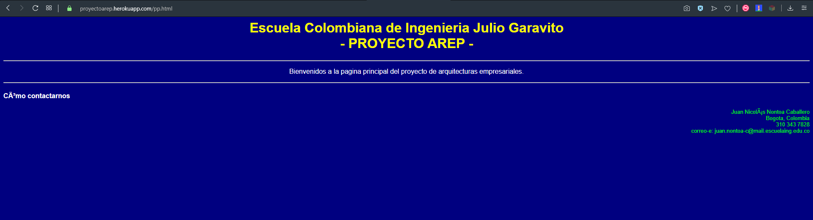
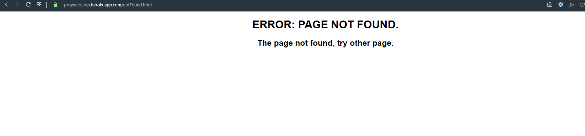
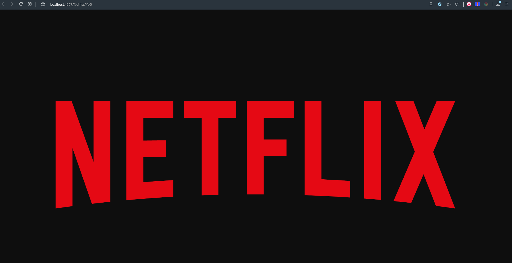
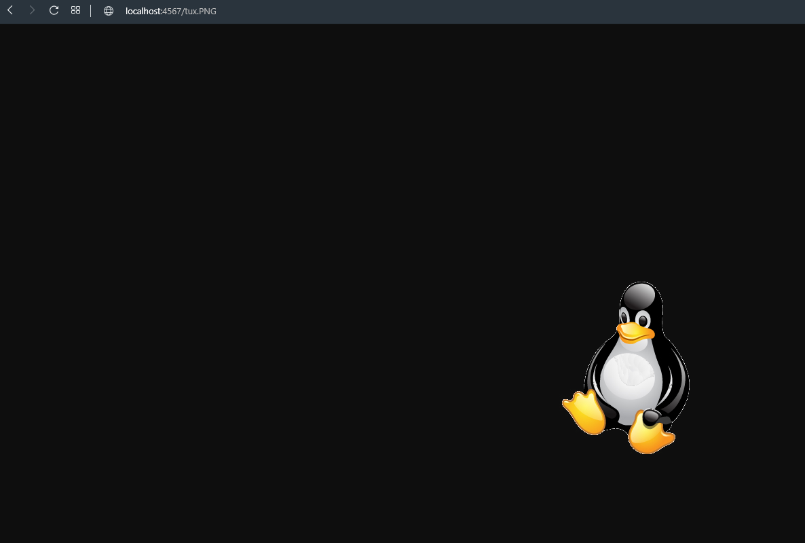
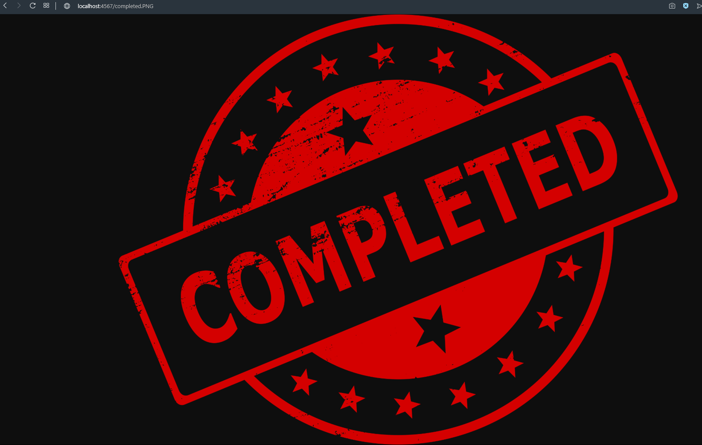
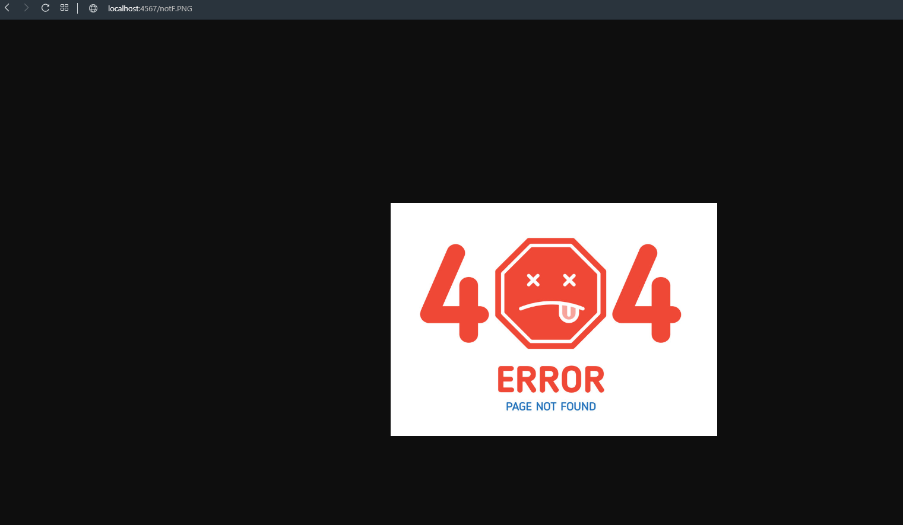
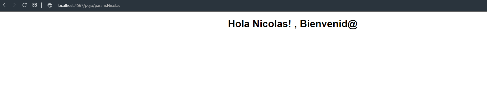
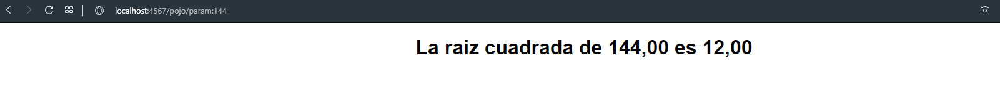

# Proyecto1-AREP

## Empezando

>Para clonar el archivo 

git clone https://github.com/nontoa/Proyecto1-AREP.git
>
### Prerrequisitos
* Maven
* Java
* Git

### Instalación

Despues de clonar el archivo para correrlo con:

* mvn package "Esto te genera el JAR"

## Construido con

* [Maven](https://maven.apache.org/) - Gestión de dependencias

## Descripción:

Servidor Web (tipo Apache) en Java. El servidor es capaz de entregar páginas html e imágenes tipo PNG. Igualmente el servidor provee un framework IoC para la construcción de aplicaciones web a partir de POJOS. La aplicación se despliega en Heroku. El servidor atiende múltiples solicitudes no concurrentes.

## Pruebas:

### Archivos HTML:

Se pueden generar peticiones de archivos Html ya establecidos en el proyecto:

* Petición para página principal.

* Petición para página de not found.

* Petición para página de Prueba.

### Imágenes:

Se pueden generar peticiones de imágenes PNG ya establecidos en el proyecto:

* Petición para imagen de Netflix.

* Petición para imagne de Tux.

* Petición para imagen de Completed.

* Petición para imagen de Not Found.

### Pojos:

El pojo tiene un parametro el cual actua diferente si es un número a si es una cadena normal. Cuando es una cadena normal saluda, si es un número calcula la raíz cuadrada de ese número.

* Cadena normal.

* Número.

## Heroku Deploy:

El proyecto se desplego en heroku en la siguiente dirección:

https://proyectoarep.herokuapp.com/index.html

## Autor

* **Juan Nicolas Nontoa Caballero**  Proyecto1-AREP - [nontoa](https://github.com/nontoa)

Consulte también la lista de [colaboradores] (https://github.com/nontoa/Proyecto1-AREP/graphs/contributors) que participaron en este proyecto.

## licencia

Este proyecto está licenciado bajo la Licencia GNU - vea el archivo [LICENSE](LICENSE) para más detalles.
